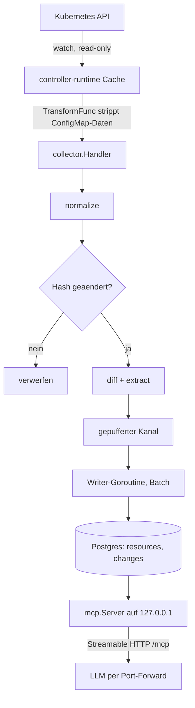
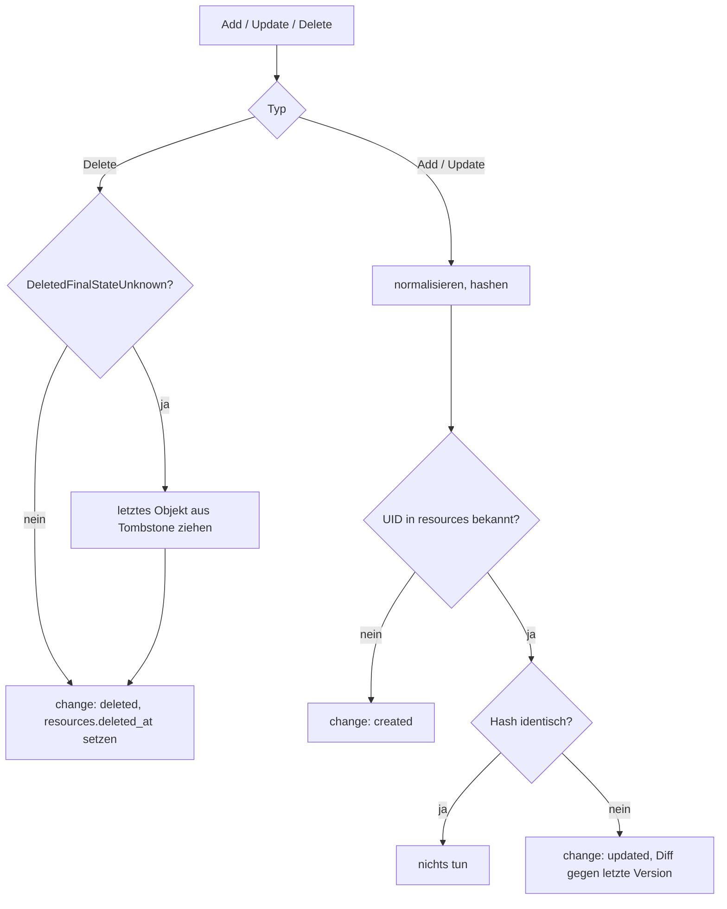
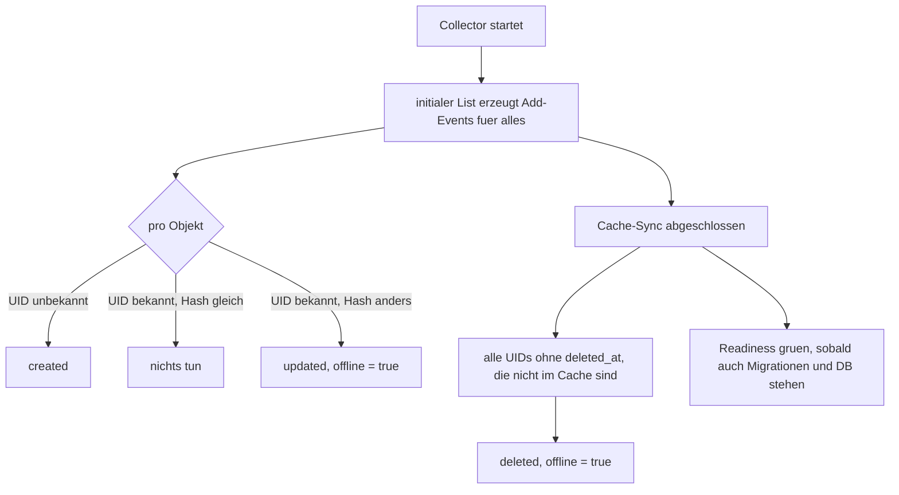

# stateinspector MVP (Phase 1+2) - Plan

## Goal Capsule

- **Objective:** Wer einen Cluster betreibt, kann rueckwirkend beantworten, was sich wann an einem Workload geaendert hat — ohne `kubectl`-Archaeologie, ohne dass jemand vorher daran gedacht hat, den Zustand zu sichern.
- **Means:** Read-only Controller historisiert normalisierte Workload-Versionen samt Diff in Postgres und gibt sie ueber einen MCP-Server an ein beliebiges LLM (KTD1).
- **Authority:** `docs/IMPLEMENTATION_PROMPT.md` bestimmt Produktumfang und Nicht-Ziele. `CLAUDE.md` bestimmt die harten Repo-Regeln (RBAC, Secrets, kubectl-Weg). Bei Konflikt gewinnt `CLAUDE.md`, weil es Sicherheitsgrenzen zieht.
- **Stop conditions:** Alles, was ins Cluster schreibt. Neue Abhaengigkeiten ausserhalb der Liste in KTD2. RBAC-Erweiterungen. Datenmodell-Aenderungen nach U6. In allen vier Faellen: nachfragen, nicht raten.
- **Execution profile:** Vierzehn Units, jede fuer sich lauffaehig und committbar, `just check` gruen als Gate. U3 bis U5 sind test-first — die Golden-Tests definieren dort, was "kein Rauschen" heisst.
- **Finished by:** `ce-work` oder ein Mensch; die Abnahme laeuft ueber die Verification Contract unten.

---

## Product Contract

### Summary

Ein Controller beobachtet Deployments, StatefulSets, DaemonSets, Services, Ingresses und ConfigMaps read-only ueber den controller-runtime Cache. Jedes Event wird normalisiert und gehasht; nur ein geaenderter Hash erzeugt einen Eintrag. Gespeichert wird das vollstaendige normalisierte Objekt plus ein RFC-6902-Patch gegen die Vorgaengerversion. Fuenf read-only MCP-Tools machen die Historie fuer ein LLM abfragbar.

### Problem Frame

Ein Cluster verliert seine Vergangenheit. Der API-Server haelt nur den Ist-Zustand; `deployment.kubernetes.io/revision` reicht zwei, drei Rollouts zurueck und sagt nichts ueber Services, Ingresses oder ConfigMaps. Wer nach einem Vorfall wissen will, welches Image am Montag lief oder was der letzte Rollout wirklich geaendert hat, rekonstruiert das aus Git, Chat-Verlaeufen und Erinnerung. Bestehende Werkzeuge loesen das entweder als SaaS — Cluster-Zustand verlaesst das Haus — oder als Audit-Log-Pipeline, die roh und unlesbar ist.

### Key Decisions

- **Vollstaendige Version pro Aenderung statt Snapshot-Tabelle** — "Zustand zum Zeitpunkt X" wird damit eine einzelne Query. Governs R10, R11, R15.
- **ConfigMap-Werte verlassen den Prozess nie, auch nicht im Arbeitsspeicher** (session-settled: user-directed — chosen over Verschiebung nach post-MVP: `cache.Options` bietet `Transform` als Einbauteil, der Fix kostet ein Dutzend Zeilen statt einer Migration spaeter). Governs R8, R9.
- **Kein Multi-Cluster** (session-settled: user-directed — chosen over einem `(cluster, uid)`-Primaerschluessel: die Spalte bleibt fuer die Herkunft, aber der Schluessel wird nicht auf Vorrat verbreitert). Governs R12.
- **Retention bleibt ausserhalb dieses MVP** (session-settled: user-directed — chosen over Aufnahme in den MVP: erst messen, wie schnell die Tabelle real waechst, dann eine Strategie waehlen statt raten). Governs R22.

### Requirements

**Beobachtung**

- R1. Der Collector beobachtet Deployments, StatefulSets, DaemonSets, Services, Ingresses und ConfigMaps ueber den controller-runtime Cache als `unstructured.Unstructured`, sodass ein Handler fuer alle Arten genuegt.
- R2. Die beobachteten Namespaces folgen `--namespaces` und `--exclude-namespaces`; ohne Angabe gilt der ganze Cluster ausser `kube-system`, `kube-public`, `kube-node-lease`.
- R3. Der Event-Handler laeuft ausschliesslich beim Leader.
- R4. Ein Event, dessen normalisierter Hash dem zuletzt bekannten entspricht, erzeugt keinen Eintrag.
- R5. Der Handler blockiert nie auf der Datenbank; Schreibvorgaenge laufen gepuffert und gebatcht.

**Normalisierung und Datenschutz**

- R6. Die Normalisierung entfernt `status`, `metadata.managedFields`, `resourceVersion`, `generation`, `creationTimestamp`, `selfLink` und `uid` sowie leere Maps und Listen, sodass `{}` und ein fehlendes Feld identisch hashen.
- R7. Die Annotationen `kubectl.kubernetes.io/last-applied-configuration` und `deployment.kubernetes.io/revision` werden entfernt; `kubectl.kubernetes.io/restartedAt` bleibt erhalten, weil es einen echten Rollout markiert.
- R8. ConfigMap-`data` und `-binaryData` werden vor dem Hashen durch `{"keys": [...sortiert], "sha256": "<Hash ueber den Inhalt>"}` ersetzt.
- R9. ConfigMap-Werte werden bereits beim Eintritt in den Informer-Cache verworfen, sodass sie weder in Datenbank noch Logs, MCP-Antworten oder Arbeitsspeicher des Prozesses landen.

**Speicherung**

- R10. Jede erkannte Aenderung wird als vollstaendiges normalisiertes Objekt plus RFC-6902-Patch und Liste der geaenderten Pfade gespeichert.
- R11. Der Aenderungstyp ist `created`, `updated` oder `deleted`; ein Loeschvorgang speichert den letzten bekannten Zustand und setzt `resources.deleted_at`.
- R12. Jede Zeile traegt den Clusternamen aus `--cluster-name`.
- R13. Aenderungen, die waehrend eines Collector-Ausfalls passiert sind, werden nach dem Cache-Sync nachgetragen und mit `offline = true` markiert — auch Loeschungen von Objekten, die nicht mehr im Cache auftauchen.

**MCP-Schnittstelle**

- R14. `list_changes` liefert Aenderungen in einem Zeitfenster, gefiltert nach Namespace, Art und Name, ohne das vollstaendige Objekt.
- R15. `get_resource` liefert das normalisierte Objekt zu einem Zeitpunkt samt `observed_at` der gelieferten Version.
- R16. `diff_resource` liefert den Patch zwischen den zu zwei Zeitpunkten gueltigen Versionen.
- R17. `get_versions` liefert aktuelle Workloads mit ihren Images; `list_resources` liefert eine Uebersicht inklusive optional geloeschter Objekte.
- R18. Jedes Tool akzeptiert Zeitangaben als RFC 3339 oder als relative Dauer (`24h`, `7d`), antwortet in UTC und kappt bei 500 Eintraegen mit sichtbarem Hinweis.

**Betrieb und Sicherheit**

- R19. Das RBAC des Controllers umfasst ausschliesslich `get`, `list`, `watch`; einzige Schreibrechte sind Leases und Events im eigenen Namespace.
- R20. Der MCP-Server bindet auf `127.0.0.1` und ist nur per Port-Forward erreichbar.
- R21. Readiness wird erst gruen, wenn der Cache gesynct ist, die Migrationen durchgelaufen sind und die Datenbank erreichbar ist.
- R22. Der Betrieb kommt ohne Aufraeumjob aus; unbegrenztes Wachstum der Historie ist im MVP akzeptiert und dokumentiert.

### Success Criteria

- `just up` bringt den Operator binnen 60 s auf Ready; `just churn` erzeugt genau die erwarteten Aenderungen, keine Duplikate.
- Status-Updates, ReplicaSet-Rollouts und Leader-Election-Leases erzeugen keinen einzigen Eintrag.
- `just k auth can-i --list --as=system:serviceaccount:stateinspector:stateinspector` zeigt nur `get`/`list`/`watch` plus Leases und Events im eigenen Namespace.
- Claude Code beantwortet ueber den MCP-Server die vier Leitfragen aus dem Origin-Dokument korrekt: was sich seit gestern in einem Namespace geaendert hat, welches Image ein Service faehrt, wie ein Deployment letzten Montag aussah, und was der letzte Rollout geaendert hat.

### Scope Boundaries

**Deferred for later**

- CRDs und `api/` (Phase 3), Image-Digests, `actor` via Audit-Log-Anbindung. Das Feld `actor` wird angelegt und bleibt NULL.
- Retention und Pruning der Historie (R22).
- Authentifizierung am MCP-Server.

**Outside this product's identity**

- Pods beobachten. Die Historie beschreibt gewollten Zustand, nicht Laufzeit.
- UI, Hub, Multi-Cluster, Cloud-APIs.
- Alles, was ins Cluster schreibt.

### Sources

- Origin: `docs/IMPLEMENTATION_PROMPT.md`
- Repo-Regeln und Konventionen: `CLAUDE.md`
- Entscheidungen und Post-MVP-Backlog: `docs/progress/PROGRESS.md`
- controller-runtime Kompatibilitaetsmatrix (CR v0.25 -> client-go v0.37, Go >= 1.26): github.com/kubernetes-sigs/controller-runtime
- MCP Go SDK v1.8.0: `NewStreamableHTTPHandler`, generisches `AddTool[In, Out]`, `NewInMemoryTransports()` fuer In-Process-Tests
- `cache.Options.ByObject[...].Transform` und `DefaultTransform`, Signatur `func(in interface{}) (interface{}, error)`
- `stdlib.OpenDBFromPool(pool *pgxpool.Pool, ...) *sql.DB` als Bruecke pgxpool -> goose
- goose v3.28: `SetBaseFS(fs.FS)`, `SetDialect(string) error`, `Up(db *sql.DB, dir string, ...) error`

---

## Planning Contract

### Key Technical Decisions

- KTD1. **Generischer Unstructured-Handler statt typisierter Controller.** Ein Handler ueber `unstructured.Unstructured` fuer alle GVKs haelt die Erweiterung auf neue Arten bei einer Zeile in `registry.go` plus Normalisierungsregel. Typisierte Controller pro Art waeren sechs fast identische Reconciler. Governs R1.
- KTD2. **Abhaengigkeiten sind abschliessend.** controller-runtime, `pgx/v5` mit pgxpool, `goose/v3`, `wI2L/jsondiff`, `modelcontextprotocol/go-sdk`, `testcontainers-go/modules/postgres`. Alles darueber hinaus braucht eine Begruendung im Commit (`CLAUDE.md`).
- KTD3. **Neueste Versions-Achse: controller-runtime v0.25.x, Go 1.27, envtest 1.37.x** (session-settled: user-directed — chosen over einem Pin auf CR v0.23: CR v0.25 verlangt Go >= 1.26, das Geruest pinnt 1.25 und wuerde nicht bauen; der Origin verlangt ohnehin die aktuelle stabile Go-Version). Governs R1.
- KTD4. **goose bekommt ein `*sql.DB` aus dem bestehenden Pool.** `stdlib.OpenDBFromPool` vermeidet eine zweite Verbindungskonfiguration; Queries laufen weiter ueber pgxpool. Das Schliessen des `*sql.DB` schliesst den Pool nicht. Governs R21.
- KTD5. **Hash ueber kanonisches JSON mit sortierten Keys, SHA-256.** Ein In-Memory-Cache UID -> Hash steht vor der Datenbank, damit der Normalfall "nichts geaendert" ohne Query auskommt. Governs R4.
- KTD6. **Ein Writer-Goroutine mit gepuffertem Kanal, Batch bei 100 Eintraegen oder 1 s.** Bei vollem Puffer wird blockiert, nicht verworfen — eine Luecke in der Historie ist schaedlicher als Rueckstau — und eine Metrik exportiert. Governs R5.
- KTD7. **ConfigMap-Strippen als Cache-`Transform`, nicht im Handler.** `cache.Options.ByObject` mit einem `*unstructured.Unstructured`, dessen GVK auf `v1/ConfigMap` gesetzt ist; die `TransformFunc` ersetzt `data` und `binaryData` durch Keys und Hash, bevor das Objekt den Cache erreicht. Im Handler zu strippen waere zu spaet — dann liegen die Werte bereits im Informer-Store. Instanziiert die ConfigMap-Entscheidung aus den Key Decisions. Governs R8, R9.
- KTD8. **MCP-Tools ueber das generische `AddTool[In, Out]`.** Das SDK leitet Input- und Output-Schema aus den Go-Typen ab und validiert Eingaben; handgeschriebene Schemata wuerden davon abdriften. Governs R14, R15, R16, R17.
- KTD9. **`created` versus `updated` entscheidet die Existenz der UID in `resources`, nicht der Event-Typ.** Nach einem Neustart erzeugt der initiale List Add-Events fuer alles; nur eine unbekannte UID ist wirklich `created`. Governs R13.

### High-Level Technical Design

Komponenten und Datenfluss:

Ereignisverarbeitung pro Event:

Start und Resync — hier entsteht `offline = true`:

### Assumptions

- ConfigMaps werden clusterweit beobachtet wie die uebrigen Arten; der Cache-Transform aus KTD7 haelt den Speicherbedarf klein genug, dass keine gesonderte Namespace-Einschraenkung noetig ist. Faellt das im Betrieb auf, ist `ByObject[ConfigMap].Namespaces` der Hebel.
- `dev/postgres.yaml` bleibt die Dev-Datenbank; der E2E-Test in CI deployt dieselbe Datei.
- Der kind-Cluster heisst in allen Umgebungen `kind-stateinspector` (justfile, Tiltfile-Guard).

### Sequencing

U1 und U2 legen das Fundament. U3 bis U5 sind reine Bibliotheken ohne Cluster- oder DB-Abhaengigkeit und koennen parallel laufen. U6 haengt an U1. U7 bis U10 bauen den Collector und brauchen U2 bis U6. U11 braucht U6. U12 bis U14 schliessen die Testpyramide.

### Risks & Dependencies

| Risiko | Wirkung | Gegenmassnahme |
|---|---|---|
| Vergessener RBAC-Marker fuer eine GVK | Informer bekommt 403, Cache synct nie, Readiness bleibt rot | U7 prueft `role.yaml` nach `just manifests` gegen die Registry; `manifests-security` nach U9 |
| Unvollstaendige Normalisierung | Jede Minute ein Eintrag pro Objekt, Historie unbrauchbar | Pflicht-Golden-Test pro Art: nur Rauschfelder geaendert -> identischer Hash (U3) |
| MCP Go SDK ist jung (v1.8.0, Spec 2026-07-28) | API-Bruch bei einem Update | Version in `go.mod` pinnen, MCP-Zugriff auf `internal/mcp` begrenzen |
| JSONB-Wachstum ohne Retention (R22) | Platzbedarf steigt unbemerkt | Datenmenge waehrend U12/U13 messen und in `docs/progress/PROGRESS.md` festhalten |
| envtest-Binaries fuer 1.37.x nicht verfuegbar | `just test-env` und CI rot | In U1 mit `go tool setup-envtest list` verifizieren, bevor die Version gepinnt wird |

---

## Implementation Units

| U-ID | Titel | Dateien (Kern) | Haengt ab von |
|---|---|---|---|
| U1 | Versions-Achse und Modul-Bootstrap | `go.mod`, `Dockerfile`, `justfile` | — |
| U2 | Manager-Skeleton und Readiness-Gate | `cmd/stateinspector/main.go` | U1 |
| U3 | Normalisierung | `internal/normalize/` | U1 |
| U4 | Diff | `internal/diff/diff.go` | U1 |
| U5 | Extraktion | `internal/extract/` | U1 |
| U6 | Store: Migrationen und Queries | `internal/store/` | U1 |
| U7 | Collector-Registry und RBAC | `internal/collector/registry.go`, `config/base/rbac/role.yaml` | U2 |
| U8 | Event-Handler und Batch-Writer | `internal/collector/handler.go`, `writer.go` | U3, U4, U5, U6, U7 |
| U9 | Resync und Offline-Reconciliation | `internal/collector/resync.go` | U8 |
| U10 | ConfigMap-Cache-Transform | `internal/collector/transform.go`, `cmd/stateinspector/main.go` | U3, U7 |
| U11 | MCP-Server und fuenf Tools | `internal/mcp/` | U6 |
| U12 | envtest-Suite | `internal/collector/collector_envtest_test.go` | U9, U10, U11 |
| U13 | E2E-Test und CI-Deploy | `test/e2e/e2e_test.go`, `.github/workflows/ci.yaml` | U12 |
| U14 | Geruest-Restdrift und README | `config/dev/kustomization.yaml`, `config/base/deployment.yaml`, `README.md` | U13 |

### U1. Versions-Achse und Modul-Bootstrap

- **Goal:** Das Repo baut mit einer in sich stimmigen Versions-Achse.
- **Requirements:** KTD3
- **Files:** `go.mod`, `go.sum`, `Dockerfile`, `justfile`, `.github/workflows/ci.yaml`
- **Approach:** Modul `github.com/Fuchsi94/stateinspector` auf Go 1.27 anlegen. `tool`-Direktiven fuer `sigs.k8s.io/controller-tools/cmd/controller-gen` und `sigs.k8s.io/controller-runtime/tools/setup-envtest`. `Dockerfile` von `GO_VERSION=1.25` auf 1.27 ziehen — CR v0.25 verlangt mindestens 1.26, der bestehende Pin baut nicht. `justfile`-Variable `envtest_k8s` von `1.34.x` auf die zu CR v0.25 passende Zeile korrigieren, vorher mit `go tool setup-envtest list` verifizieren. Die bereits erfolgte Korrektur der golangci-lint-Action auf v9 gegenpruefen.
- **Test Scenarios:** `go build ./...` uebersetzt. `go tool setup-envtest use <version> -p path` liefert einen existierenden Pfad. `docker build .` laeuft bis zum Compile-Schritt durch.
- **Verification:** `just lint` gruen.

### U2. Manager-Skeleton und Readiness-Gate

- **Goal:** Ein Pod laeuft, meldet Liveness sofort und Readiness erst, wenn er wirklich arbeitsfaehig ist.
- **Requirements:** R2, R3, R20, R21
- **Files:** `cmd/stateinspector/main.go`
- **Approach:** Alle sieben Flags aus dem Origin registrieren, `DATABASE_URL` als Pflicht aus der Umgebung lesen und bei Fehlen mit klarer Meldung abbrechen. Manager mit Metrics- und Health-Bind-Address, Leader Election ueber `--leader-elect`. Cache-Namespaces aus `--namespaces` und `--exclude-namespaces` ableiten. Readiness als benannter Check, der erst true liefert, wenn Cache-Sync, Migrationen und ein DB-Ping erfolgreich waren; Liveness bleibt davon unabhaengig, damit ein DB-Ausfall den Pod nicht in eine Restart-Schleife zwingt. Logging ueber `logr` aus controller-runtime (zap) mit den strukturierten Keys `gvk`, `namespace`, `name`, `uid` aus `CLAUDE.md`, sodass die spaeteren Units sie nur noch verwenden.
- **Test Scenarios:** Fehlendes `DATABASE_URL` beendet den Prozess mit Exit-Code ungleich null und nennt die Variable. `--exclude-namespaces` mit Default schliesst genau die drei Systemnamespaces aus. `/healthz` antwortet, waehrend `/readyz` noch 503 liefert.
- **Verification:** `just up` zeigt einen laufenden Pod; `just k -n stateinspector get pod` erreicht Ready.

### U3. Normalisierung

- **Goal:** Zwei Objekte, die sich nur im Rauschen unterscheiden, hashen identisch.
- **Requirements:** R6, R7, R8
- **Files:** `internal/normalize/normalize.go`, `rules.go`, `hash.go`, `testdata/<kind>/`
- **Approach:** Globale Regeln zuerst, danach artspezifische aus einer Tabelle `map[schema.GroupKind][]Rule`, damit eine neue Art eine Zeile kostet. Leere Maps und Listen nach dem Entfernen von Feldern aufraeumen, sonst hashen `{}` und "fehlt" unterschiedlich. Service behaelt `spec.clusterIP` und `spec.clusterIPs`, verliert `spec.ipFamilies` und `spec.ipFamilyPolicy`. ConfigMap ersetzt `data` und `binaryData` durch Keys und Hash. Hash ueber kanonisches JSON mit sortierten Keys, SHA-256 (KTD5).
- **Execution note:** Test-first. Die Golden-Files definieren, was Rauschen ist — sie nachtraeglich an die Implementierung anzupassen entwertet den Test.
- **Test Scenarios:** Pro Art ein Golden-Paar `input.yaml` / `want.json`. Pro Art der Pflichtfall: nur `resourceVersion`, `generation` und `managedFields` geaendert -> identischer Hash. Deployment mit gesetztem `kubectl.kubernetes.io/restartedAt` -> Annotation bleibt erhalten und der Hash aendert sich. ConfigMap mit `LOG_LEVEL: info` -> weder `info` noch `LOG_LEVEL` als Wert im normalisierten Objekt, aber `LOG_LEVEL` in der Keys-Liste. Objekt mit leerer `labels: {}` und Objekt ohne `labels` -> identischer Hash. Schluesselreihenfolge im Input vertauscht -> identischer Hash.
- **Verification:** `just test`

### U4. Diff

- **Goal:** Aus zwei normalisierten Objekten entstehen Patch und Pfadliste.
- **Requirements:** R10
- **Files:** `internal/diff/diff.go`
- **Approach:** `wI2L/jsondiff` liefert den RFC-6902-Patch; die geaenderten Pfade aus den Operationen ableiten.
- **Test Scenarios:** Identische Objekte -> leerer Patch, leere Pfadliste. Geaendertes Container-Image -> genau ein Pfad `/spec/template/spec/containers/0/image`. Hinzugefuegtes Label -> `add`-Operation mit korrektem Pfad. Entfernter Container -> `remove`-Operation.
- **Verification:** `just test`

### U5. Extraktion

- **Goal:** Images und Owner stehen als eigene Spalten fuer Queries bereit.
- **Requirements:** R17
- **Files:** `internal/extract/images.go`, `owners.go`
- **Approach:** Images aus `containers[]` und `initContainers[]` des Pod-Templates. Owner ist die erste `ownerReference` mit `controller: true` als `kind/name`, sonst NULL.
- **Test Scenarios:** Deployment mit einem Container und einem initContainer -> beide Images in stabiler Reihenfolge. Service ohne Pod-Template -> leeres Slice, kein Fehler. Objekt ohne `ownerReferences` -> Owner NULL. Objekt mit mehreren Referenzen, davon eine mit `controller: true` -> genau diese.
- **Verification:** `just test`

### U6. Store: Migrationen und Queries

- **Goal:** Schema und Zugriffsschicht stehen; Migrationen laufen beim Start.
- **Requirements:** R10, R11, R12, R21, R22
- **Files:** `internal/store/store.go`, `queries.go`, `migrations/0001_init.sql`
- **Approach:** Schema exakt wie im Origin, inklusive `actor` als bewusst leerem Feld. pgxpool fuer Queries; `stdlib.OpenDBFromPool` liefert goose das `*sql.DB` (KTD4). Migrationen per `embed` und `goose.SetBaseFS`. Batch-Insert fuer `changes` plus Upsert auf `resources`. Lesequeries fuer die fuenf MCP-Tools, insbesondere "letzte Version pro UID mit `observed_at <= X` und nicht geloescht".
- **Test Scenarios:** Testcontainers-Postgres. Migration laeuft auf leerer Datenbank durch und ist ein zweites Mal idempotent. Insert mit `change_type = 'purged'` verletzt den CHECK-Constraint. Batch aus 150 Eintraegen landet vollstaendig. Zeitpunktquery liefert bei drei Versionen die zum Zeitpunkt gueltige, nicht die neueste. Zeitpunktquery auf ein geloeschtes Objekt liefert nichts, wenn der Zeitpunkt nach `deleted_at` liegt. `actor` ist nach dem Schreiben NULL.
- **Verification:** `just test-env`

### U7. Collector-Registry und RBAC

- **Goal:** Die beobachteten GVKs und die Rechte dafuer stehen an einer Stelle und driften nicht auseinander.
- **Requirements:** R1, R19
- **Files:** `internal/collector/registry.go`, `config/base/rbac/role.yaml`
- **Approach:** Liste der sechs GVKs plus je ein `+kubebuilder:rbac`-Marker mit `verbs=get;list;watch`. `just manifests` regeneriert `role.yaml`.
- **Test Scenarios:** Tabellentest ueber die Registry: jede GVK hat nicht-leere Group, Version und Kind. `role.yaml` enthaelt nach `just manifests` keine Verben ausser `get`, `list`, `watch`, kein `secrets` und keinen Wildcard.
- **Verification:** `just manifests` erzeugt keinen unerwarteten Diff; `just k auth can-i --list --as=system:serviceaccount:stateinspector:stateinspector` zeigt nur Lesen plus Leases und Events.

### U8. Event-Handler und Batch-Writer

- **Goal:** Echte Aenderungen landen in der Datenbank, Rauschen nicht, und der API-Handler wartet nie auf Postgres.
- **Requirements:** R3, R4, R5, R10, R11
- **Files:** `internal/collector/handler.go`, `writer.go`
- **Approach:** Runnable mit `NeedLeaderElection() == true`, das Informer-Event-Handler auf dem Manager-Cache registriert. Pro Event: normalisieren, hashen, gegen den In-Memory-Cache UID -> Hash pruefen, bei Abweichung gegen die letzte gespeicherte Version diffen und in den Kanal geben (KTD5, KTD9). Delete behandelt `DeletedFinalStateUnknown` und zieht das Objekt aus dem Tombstone. Writer-Goroutine batcht bei 100 Eintraegen oder 1 s; voller Puffer blockiert und erhoeht einen Zaehler (KTD6).
- **Test Scenarios:** Unit gegen einen Store-Fake. Zweimal dasselbe Objekt -> ein Eintrag. Objekt mit geaendertem `resourceVersion`, sonst gleich -> kein Eintrag. Unbekannte UID -> `created`. Bekannte UID mit anderem Hash -> `updated` mit nicht-leerem Patch. Delete-Event mit `DeletedFinalStateUnknown` -> `deleted` mit dem Objekt aus dem Tombstone. 250 Events am Stueck -> alle 250 gespeichert, mehr als ein Batch. Store-Fehler im Writer -> Fehler geloggt, Goroutine laeuft weiter.
- **Verification:** `just test`

### U9. Resync und Offline-Reconciliation

- **Goal:** Was passiert, waehrend der Collector steht, geht nicht verloren.
- **Requirements:** R13
- **Files:** `internal/collector/resync.go`
- **Approach:** Beim initialen List entscheidet die Existenz der UID in `resources`, nicht der Event-Typ (KTD9): unbekannt -> `created`, bekannt mit anderem Hash -> `updated` mit `offline = true`. Nach abgeschlossenem Cache-Sync einmal alle UIDs ohne `deleted_at` gegen den Cache halten; was fehlt, wird `deleted` mit `offline = true`.
- **Execution note:** Danach `manifests-security` anwenden (Origin: nach Schritt 4).
- **Test Scenarios:** Objekt vor dem Start geaendert -> genau ein `updated` mit `offline = true`, nicht zwei Eintraege. Unveraendertes Objekt beim Neustart -> kein Eintrag. Objekt waehrend des Stillstands geloescht -> ein `deleted` mit `offline = true` und gesetztem `resources.deleted_at`. Bereits als geloescht markiertes Objekt -> kein zweiter Eintrag beim naechsten Start.
- **Verification:** `just test-env`

### U10. ConfigMap-Cache-Transform

- **Goal:** ConfigMap-Werte existieren im Prozess zu keinem Zeitpunkt.
- **Requirements:** R8, R9
- **Files:** `internal/collector/transform.go`, `cmd/stateinspector/main.go`
- **Approach:** `cache.Options.ByObject` mit einem `*unstructured.Unstructured`, dessen GVK auf `v1/ConfigMap` gesetzt ist — beim Unstructured-Watch traegt die Instanz die GVK, nicht der Go-Typ. Die `TransformFunc` ersetzt `data` und `binaryData` durch Keys und Hash und gibt das Objekt zurueck; der Store bekommt damit nie Werte zu sehen (KTD7). Die Hash-Berechnung teilt sich die Funktion aus U3, damit beide Pfade nicht auseinanderlaufen.
- **Test Scenarios:** ConfigMap mit zwei Schluesseln durch die TransformFunc -> `data` enthaelt nur `keys` und `sha256`, kein Wert. Gleicher Inhalt in anderer Schluesselreihenfolge -> gleicher `sha256`. Geaenderter Wert bei gleichen Schluesseln -> anderer `sha256`. Ein anderes Objekt als ConfigMap durch dieselbe Funktion -> unveraendert zurueck. Nicht-`unstructured`-Eingabe -> Fehler statt Panic.
- **Verification:** `just test`; im envtest zusaetzlich der Nachweis, dass kein ConfigMap-Wert in der Datenbank steht.

### U11. MCP-Server und fuenf Tools

- **Goal:** Ein LLM beantwortet die vier Leitfragen ohne weiteren Kontext.
- **Requirements:** R14, R15, R16, R17, R18, R20
- **Files:** `internal/mcp/server.go`, `tools.go`
- **Approach:** `NewStreamableHTTPHandler` unter `/mcp`, gebunden an `--mcp-bind-address` mit Default `127.0.0.1:8081`. Die fuenf Tools ueber das generische `AddTool[In, Out]`, sodass Schemata aus den Go-Typen entstehen (KTD8). Ein gemeinsamer Zeitparser akzeptiert RFC 3339 und relative Dauern inklusive `d`, das Go selbst nicht kennt. Harte Kappung bei 500 Eintraegen mit einem Feld in der Antwort, das die Kuerzung sichtbar macht. Tool-Beschreibungen so formulieren, dass ein Modell ohne Zusatzkontext das richtige Werkzeug waehlt.
- **Test Scenarios:** Zeitparser: `24h`, `7d`, `2026-09-29T10:00:00Z` werden korrekt aufgeloest; `gestern` und `7x` liefern Fehler. `list_changes` mit `since=24h` liefert nur Eintraege im Fenster und kein vollstaendiges Objekt. `get_resource` ohne `at` liefert die aktuelle Version, mit `at` vor der letzten Aenderung die vorherige samt passendem `observed_at`. `get_resource` auf ein unbekanntes Objekt -> leeres Ergebnis mit klarer Meldung, kein Fehler. `diff_resource` ueber ein Image-Update -> Patch mit dem Image-Pfad. `list_resources` mit `include_deleted=false` unterdrueckt geloeschte Objekte, mit `true` zeigt es sie samt `deleted_at`. 600 passende Eintraege -> 500 geliefert und Kuerzung markiert.
- **Verification:** `just test-env` mit `NewInMemoryTransports()` als In-Process-Client gegen eine befuellte Datenbank.

### U12. envtest-Suite

- **Goal:** Der Collector ist gegen einen echten API-Server nachgewiesen, nicht nur gegen Fakes.
- **Requirements:** R1, R4, R10, R11, R13
- **Files:** `internal/collector/collector_envtest_test.go`
- **Approach:** Build-Tag `envtest`. Postgres via testcontainers, API-Server via envtest. Collector gegen beide starten.
- **Test Scenarios:** Deployment anlegen -> `created`. Image aendern -> `updated` mit Pfad `/spec/template/spec/containers/0/image`. Nur den Status patchen -> kein Eintrag. Deployment loeschen -> `deleted` mit gesetztem `resources.deleted_at`. Neustart-Szenario: Collector stoppen, Objekt aendern, Collector starten -> genau ein `updated` mit `offline = true`. ConfigMap anlegen und Wert aendern -> zwei Eintraege, in keinem der Wert. Service anlegen -> ein Eintrag; die vom API-Server gesetzte `clusterIP` erzeugt keinen zweiten.
- **Verification:** `just test-env`

### U13. E2E-Test und CI-Deploy

- **Goal:** Der ganze Weg von `kubectl set image` bis zur MCP-Antwort ist gegen einen echten Cluster nachgewiesen — lokal und in CI.
- **Requirements:** R14, R19, R20
- **Files:** `test/e2e/e2e_test.go`, `.github/workflows/ci.yaml`
- **Approach:** Build-Tag `e2e`. Lokal gegen den laufenden kind-Cluster aus `just up`. In CI deployt der Test selbst `dev/postgres.yaml` und `config/dev`. Der offene Punkt aus `docs/progress/PROGRESS.md` wird hier geschlossen: der `e2e`-Job macht bisher nur `kubectl apply -k config/base --dry-run=client` und deployt damit weder Postgres noch den Operator, und `config/dev` referenziert hart `stateinspector` statt des Images aus `E2E_IMAGE`. Beides aufloesen — entweder ueber einen `images:`-Eintrag in der Kustomization oder indem der Test das Image-Feld vor dem Apply setzt.
- **Execution note:** Danach `manifests-security` anwenden (Origin: nach Schritt 6).
- **Test Scenarios:** `kubectl set image` auf `demo/web`, dann `list_changes(since=5m)` -> Eintrag mit dem Image-Pfad. Zweimal dasselbe Image setzen -> kein zweiter Eintrag. Der Test scheitert sichtbar, wenn der Operator nicht Ready wird, statt in einen Timeout ohne Diagnose zu laufen.
- **Verification:** `just e2e` lokal gruen; CI-Job `e2e` gruen.

### U14. Geruest-Restdrift und README

- **Goal:** Das Geruest enthaelt keine stillen Fallen mehr, und das README zeigt echte Antworten.
- **Requirements:** R20, R22
- **Files:** `config/dev/kustomization.yaml`, `config/base/deployment.yaml`, `README.md`, `docs/progress/PROGRESS.md`
- **Approach:** Den Index-Patch `path: /spec/template/spec/containers/0/args/1` in `config/dev` durch eine gegen Umsortierung robuste Form ersetzen — sonst patcht eine spaetere Flag-Umstellung still das falsche Argument. `deployment.yaml` deklariert nur `containerPort: 8080`; MCP (8081) und Health (8082) ergaenzen, damit die Ports dokumentiert sind. README um die vier Leitfragen mit echten Antworten aus dem lokalen Cluster ergaenzen und die fehlende Retention (R22) als bekannte Grenze benennen.
- **Test Expectation:** none — reine Manifest- und Dokumentationsarbeit; die Wirkung wird durch `just up` und U13 abgedeckt.
- **Verification:** `just up` laeuft unveraendert; `just k -n stateinspector get deploy stateinspector -o yaml` zeigt alle drei Ports.

---

## Verification Contract

| Gate | Befehl | Gilt fuer | Signal |
|---|---|---|---|
| Lint | `just lint` | alle Units | golangci-lint v2 ohne Findings |
| Unit | `just test` | U1, U3, U4, U5, U8, U10 | gruen mit `-race` |
| envtest | `just test-env` | U6, U9, U11, U12 | gruen; testcontainers-Postgres und envtest-API-Server |
| Vor jedem Commit | `just check` | alle Units | Lint, Unit und envtest zusammen gruen |
| E2E | `just e2e` | U13 | gruen gegen laufenden kind-Cluster |
| RBAC | `just k auth can-i --list --as=system:serviceaccount:stateinspector:stateinspector` | U7, U14 | nur `get`/`list`/`watch` plus Leases und Events |
| Rauschfreiheit | `just churn`, dann `just psql` | U12, U13 | genau die erwarteten Eintraege, keine Duplikate |
| Datenschutz | `just psql` nach `just churn` | U10 | kein ConfigMap-Wert in `resources` oder `changes` |
| Security-Review | Skill `manifests-security` | nach U9 und nach U13 | keine offenen Abweichungen |

---

## Definition of Done

Global:

- `just check` und `just e2e` gruen, CI gruen.
- `just up` bringt den Operator binnen 60 s auf Ready.
- `just churn` erzeugt genau die erwarteten Aenderungen; Status-Updates, ReplicaSet-Rollouts und Leader-Election-Leases erzeugen keine.
- Weder Datenbank noch Logs noch MCP-Antworten enthalten ConfigMap-Werte.
- Das RBAC zeigt ausschliesslich Leserechte plus Leases und Events im eigenen Namespace.
- Claude Code beantwortet ueber den MCP-Server die vier Leitfragen korrekt.
- Kein Code aus verworfenen Ansaetzen bleibt im Diff zurueck; `api/` bleibt leer.
- `docs/progress/PROGRESS.md` haelt die beobachtete Datenmenge fest, damit die Retention-Entscheidung spaeter auf Messwerten fusst.

Pro Unit: die unter Verification genannten Befehle sind gruen, und jede feature-tragende Unit hat ihre Testszenarien als echte Tests, nicht als Kommentar.
